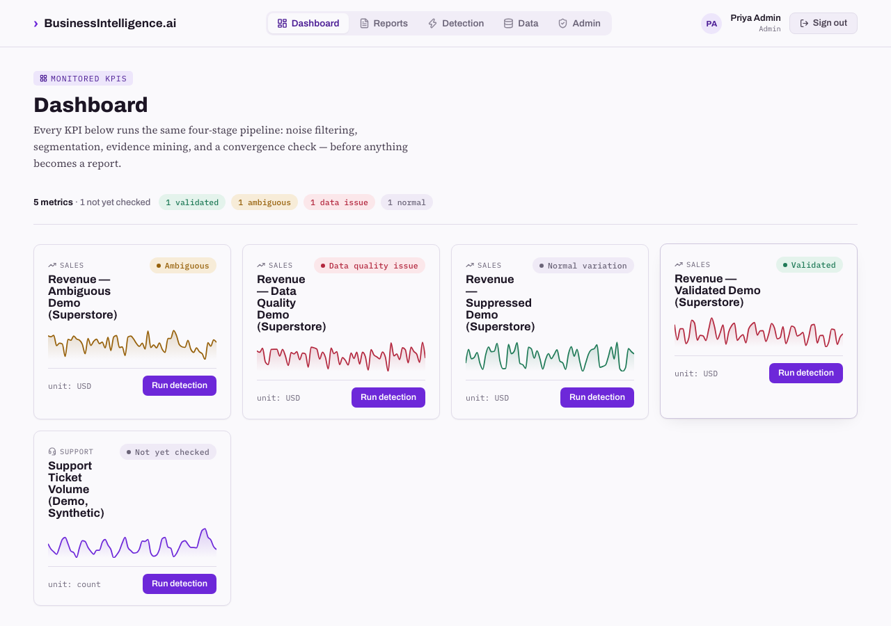
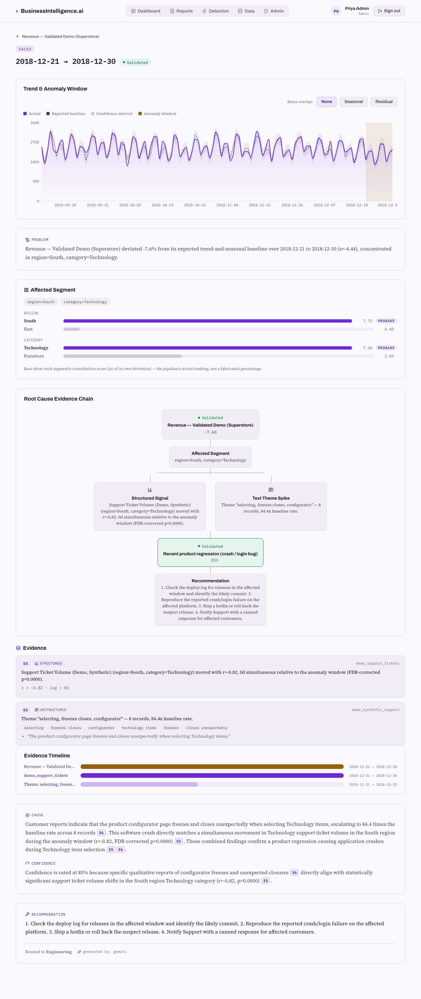
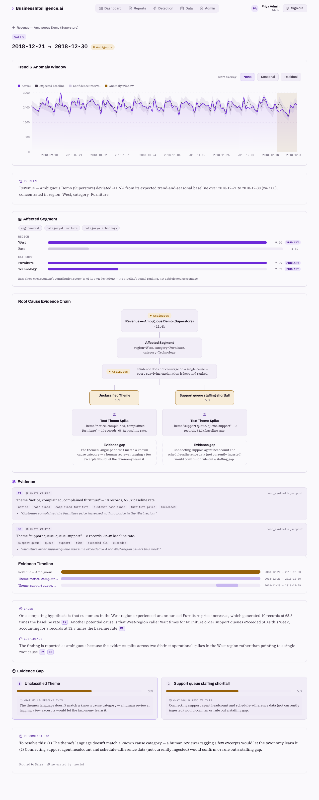
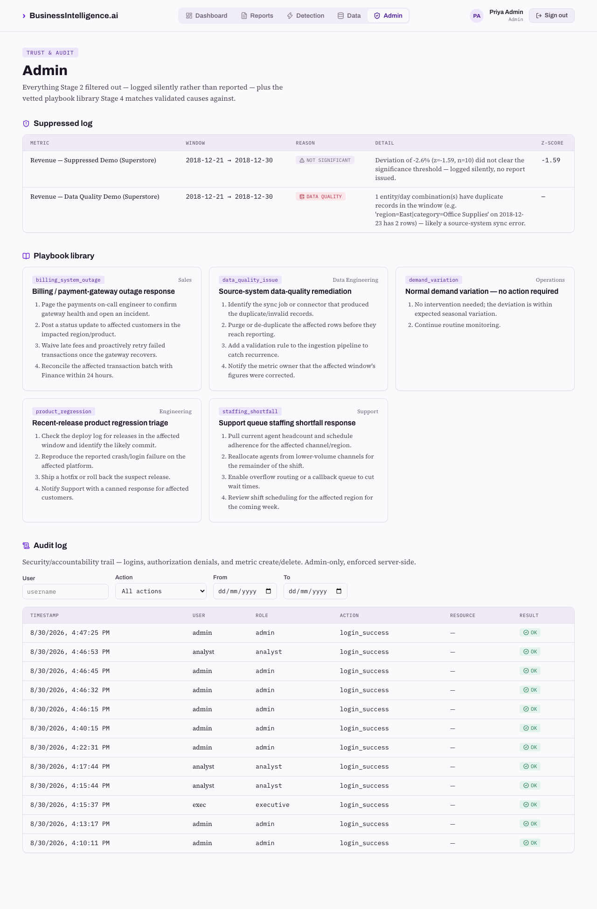

# BusinessIntelligence.ai

A KPI storytelling and root-cause diagnosis engine. It turns a dashboard alert ("revenue is
down 8%") into a grounded, evidence-cited diagnosis and recommended action — in minutes,
without asserting a cause the evidence doesn't actually support.

Built for the Accenture Innovation Challenge 2026 by Team Meta Agent. This repo implements
the system described in [`BusinessIntelligence.ai - SRS.html`](./BusinessIntelligence.ai%20-%20SRS.html)
and [`BusinessIntelligence.ai - Design Document.html`](./BusinessIntelligence.ai%20-%20Design%20Document.html) —
those two documents are this project's specification; this README documents the implementation.

## Contents

- [What it actually does](#what-it-actually-does)
- [Screenshots](#screenshots)
- [Why the results are trustworthy, not just plausible](#why-the-results-are-trustworthy-not-just-plausible)
- [Security, audit, and data-integrity hardening](#security-audit-and-data-integrity-hardening)
- [Explicit assumptions](#explicit-assumptions-things-the-srsdesign-doc-dont-specify-at-implementation-level)
- [Getting started with your own data](#getting-started-with-your-own-data)
- [Test fixture: the synthetic dataset](#test-fixture-the-synthetic-dataset)
- [Demo dataset: judge-facing scenarios](#demo-dataset-judge-facing-scenarios)
- [Architecture](#architecture)
- [Data model](#data-model)
- [API](#api)
- [Authentication & roles](#authentication--roles)
- [Setup](#setup)
- [Using it](#using-it)
- [Testing](#testing)
- [Known limitations](#known-limitations)
- [Deployment notes](#deployment-notes)

## What it actually does

Four stages, run for every monitored KPI:

1. **Data Ingestion** — structured metrics and unstructured text (support tickets, call notes)
   land in a common Observation Store, uploaded as CSV/Excel through the Data page.
2. **Noise Filtering** — a data-quality check, an STL time-series decomposition, and a
   sample-size-scaled significance test decide whether a deviation is real or normal variation.
   Anything that isn't real is logged silently and never becomes a report.
3. **Root-Cause Engine** — the confirmed anomaly is segmented (which region/product/channel is
   actually driving it), then two things happen in parallel: a search for co-moving structured
   metrics, and NLP thematic clustering of unstructured text in the same segment and window. A
   cause is only **validated** if a structured signal and a thematically-relevant text spike
   agree. If they don't converge, every surviving explanation is kept, ranked, and given a named
   gap — never a single fabricated cause.
4. **Recommendation** — a validated cause is mapped to a vetted playbook; either way, an
   LLM (or, without an API key, a deterministic writer) turns the evidence into a report, with a
   grounding guard that strips any sentence not backed by a real citation.

## Screenshots

All four screenshots below are from a live run against the real demo dataset (`seed_demo.py`),
not mockups — the report text is genuine Gemini output, grounded and cited by the pipeline
described in this README.

**Dashboard** — every monitored KPI with a real status pill, never a placeholder:



**A validated root cause** — segmentation, the evidence chain, cited cause/confidence text, and
a routed recommendation:



**A genuinely ambiguous case** — two ranked hypotheses, each with a named evidence gap, neither
promoted to a single fabricated answer:



**Admin — suppressed-log audit trail, the playbook library, and the security audit log** with
user/action/date filters:



## Why the results are trustworthy, not just plausible

This is the part of the SRS/pitch deck that's easy to build a UI for and hard to build for real —
so it's worth spelling out what the pipeline actually enforces, not just displays:

- **Correlation is not treated as causation.** Two metrics can co-move by chance with this
  little data — a scenario in the synthetic test fixture deliberately demonstrates it (Customer
  Satisfaction happens to correlate with Churn Rate at r=-0.62, about as strongly as the *real*
  Revenue/Payment-Failure-Rate link at r=-0.64 in that same fixture). A cause is only validated when the correlated
  structured metric is on a taxonomy-approved list of plausible drivers *for that specific theme's
  cause category* — not merely "some metric moved together with some ticket theme." See
  `CAUSE_STRUCTURED_DRIVERS` in `backend/app/pipeline/convergence.py`.
- **The anti-hallucination guard is code, not a prompt instruction.** The LLM is asked to cite
  an evidence id after every sentence; a regex-based guard (`backend/app/pipeline/narrative.py`)
  independently re-parses the response and deletes any sentence with a missing or invalid
  citation before it reaches a report. Deleted sentences are recorded in `Report.stripped_claims`,
  visible in the UI.
- **Significance is tested against a forecast, not a fit that already saw the anomaly.** An
  early implementation fit STL across the whole series including the anomaly window; STL's trend
  component partially absorbed the shift at the series boundary, understating real anomalies.
  The fix: fit on history only, extrapolate forward (Theil-Sen, robust to boundary noise), and
  compare the window against that forecast. See the comments in
  `backend/app/pipeline/series_utils.py`.

## Security, audit, and data-integrity hardening

A separate engineering pass hardened the reference implementation beyond "the pipeline gives
correct answers" — these don't change any statistical result, they make the system safe to run
somewhere real:

- **JWT secret is refused at startup if it's insecure in production.** The published default
  (`dev-insecure-secret-change-me`) works with zero config for local development, but
  `app/config.py`'s `Settings` validator raises immediately — before the app can serve a single
  request — if `APP_ENV=production` and the secret is still that default or under 32 characters.
  This can't be silently bypassed; there's no code path that starts the app anyway. See
  `backend/tests/test_config_security.py`.
- **A persistent, append-only AuditLog — distinct from operational logging.** `app/logging_config.py`'s
  structured logs are for debugging; `AuditLog` (`app/models.py`) is a separate DB table for
  accountability: who did what, when, to what, and whether it succeeded. It records login
  success/failure, authorization denials (a real 403, not a hidden button), and metric
  create/delete — deliberately *not* every pipeline event, so it stays a security/business trail
  rather than a duplicate of the operational log. Never stores passwords, tokens, or raw
  customer text. Readable only by `admin` via `GET /api/admin/audit-log` (filterable by
  user/action/date), both in the API and the Admin page's **Audit log** section. See
  `backend/app/audit.py` and `backend/tests/test_audit.py`.
- **TextEvidence duplicate detection is content-and-context-aware, not text-only.** Two
  observations are the same only if they match on text *and* date *and* source system *and*
  segment — an identical sentence from two different customers, or the same customer on two
  different days, is correctly kept as two separate pieces of evidence. Uploading the literal
  same file twice reports `duplicates_skipped` instead of silently doubling the corpus. See
  `_text_evidence_signature` in `backend/app/pipeline/ingestion.py`.
- **Composite database indexes match actual query patterns, not guesswork.** Every index in
  `app/models.py` exists because a real, traced query filters or orders on exactly those
  columns — e.g. `Observation(metric_id, timestamp)` for the series-loading hot path, or
  `Report(routed_to, created_at)` because department-scoped RBAC always filters then sorts that
  way. Columns that are never queried directly (`Segment.dimension`/`value`, always reached via
  the indexed `anomaly_id` relationship) are deliberately left unindexed. Verified portable to
  both SQLite and Postgres via `sqlalchemy.inspect()`, not dialect-specific SQL — see
  `backend/tests/test_database_indexes.py`.

## Explicit assumptions (things the SRS/Design Doc don't specify at implementation level)

1. **NLP theme mining** uses TF-IDF + NMF (scikit-learn), not sentence-transformers/BERTopic as
   named in the Design Doc — those require downloading large models, impractical for a local
   demo runtime. Isolated behind `pipeline/evidence_mining.py::mine_themes` so it's swappable.
2. **No live CRM/ERP/ticketing/finance/HR API connectors.** Real data gets in via CSV/Excel
   upload (`pipeline/ingestion.py`), which is what a live connector would ultimately feed into
   anyway — the pipeline downstream can't tell the difference. `data/synthetic.py` still exists,
   but only as deterministic test-fixture data (see "Test fixture" below), not something the
   running app seeds itself with.
3. **Playbook matching is rule-based** (`pipeline/playbooks.py`, exact `cause_category` lookup)
   rather than an embedding index — reasonable for a small, vetted library.
4. **Intelligent Routing** sets a `routed_to` department field and surfaces it as a per-department
   filter in the Reports page, rather than sending real email/Slack — no credentials available.
5. **No background scheduler.** New data only gets evaluated when you click **Run detection** on
   a metric (always its latest 10-day window) — there's no cron/poller re-checking uploaded data
   automatically.
6. **Upload validation rejects the whole file on any problem** (a missing column, an unparseable
   date/value, an empty file) rather than silently skipping bad rows — this is someone's real
   business data, and a partial, silently-corrupted import is worse than a rejected one they can
   fix and retry. See `pipeline/ingestion.py`.
7. **SQLite by default**, swappable to Postgres via `DATABASE_URL` with no code changes
   (SQLAlchemy handles both).
8. **Password hashing uses stdlib PBKDF2-SHA256** (260k iterations, per-user salt), not
   bcrypt/argon2 — avoids a compiled native dependency, and is an OWASP-acceptable choice at
   this scale. See `backend/app/security.py`.
9. **PII redaction is regex-based**, not an NER model — emails, phone numbers, card numbers,
   and SSNs are pattern-shaped enough that a deterministic, auditable pass catches them without
   a model download. See `backend/app/pipeline/pii_redaction.py`.

## Getting started with your own data

The app starts empty. You populate it from the **Data** page: an admin creates a metric, then
an analyst or admin uploads its observations as a CSV or Excel file. Upload unstructured
evidence (tickets, call notes) separately — it isn't tied to one metric, and the root-cause
engine matches it to an anomaly by date and segment at analysis time, not at upload time.

**Creating a metric** — you declare its dimensions up front (e.g. `region, product`); every
observations file you upload for that metric must have exactly those columns.

**Observations CSV/Excel** (per metric):
```
date,value,<dim1>,<dim2>,...[,source_system]
2026-01-01,8213.45,South,Product B,crm
```
Required: `date`, `value`, and each declared dimension column. Optional: `source_system`
(defaults to `"uploaded"`). Column names are matched case/whitespace-insensitively; currency
formatting (`$`, `,`, `%`) in `value` is stripped before parsing.

**Text evidence CSV/Excel** (global, not tied to one metric):
```
date,text,source_system,region,product,...
2026-01-01,"Customer reported a failed payment.",ticketing,South,Product B
```
Required: `date`, `text`. Optional: `source_system`; every other column becomes a segment
dimension. `text` is PII-redacted (emails/phones/card numbers/SSNs) before it's stored.

Every metric's page has a **Download template** button that generates a correctly-headed CSV
skeleton for its declared dimensions — start from that rather than hand-writing headers.

**A small amount of data works, but two full seasonal cycles unlocks trend/seasonal
decomposition** — with the default weekly period (7), that's 14+ days of history. Below that,
the chart shows raw values and Stage 2's significance test can't yet distinguish a real anomaly
from noise (everything reads as "normal variation" until there's enough history to compare
against).

## Test fixture: the synthetic dataset

`backend/app/data/synthetic.py` is **not used by the running app** — it exists purely so the
test suite has a known, deterministic dataset with known-correct pipeline outcomes to assert
against (`tests/conftest.py`, and `scripts/seed_test_fixture.py` for e2e testing). It generates
365 days of daily observations for 5 metrics — Revenue, Payment Failure Rate, CSAT, Ticket
Volume, Churn Rate — each segmented by region/product/channel, plus ~175+ unstructured text
records. Four scenarios are built into the most recent 10-day window, each exercising a
different pipeline outcome:

| Scenario | Metric / segment | Outcome |
|---|---|---|
| UC-1 (mirrors SRS Appendix A) | Revenue, South × Product B | **Validated** — converges with a Payment Failure Rate spike and a "payment failed" ticket theme → Billing Outage playbook |
| UC-2 (mirrors SRS Appendix A) | CSAT, East × Chat | **Ambiguous** — two competing ticket themes (product bug vs. staffing), neither with a structured correlate → ranked hypotheses with named disambiguation gaps |
| UC-3 (mirrors SRS Appendix A) | Ticket Volume, Product C | **Suppressed (noise)** — a ~5% deviation stays inside the confidence interval |
| Extra | Churn Rate, West | **Suppressed (data quality)** — a duplicated sync record is caught before any significance test runs |

Note: an HR system / agent-headcount metric is deliberately never included in this fixture —
its absence is what gives the CSAT ambiguous scenario a real, nameable evidence gap ("connecting
agent headcount data would confirm or rule out this cause") instead of a scripted one.

## Demo dataset: judge-facing scenarios

For a live demonstration, `backend/app/data/demo_scenarios.py` builds a **third** dataset —
distinct from both the empty-start production app and the synthetic pytest fixture above — on
**real** historical revenue from the Kaggle ["Sample Superstore"](https://www.kaggle.com/datasets/rohitsahoo/sales-forecasting)
dataset, the same one `kaggle_data/prepare_superstore.py` already prepares (see that script's
docstring for where to download the raw file — nothing here touches the network or the Kaggle
API at seed time).

### What's real, what's derived, and what's synthetic — and where the app shows you which

| | Source | Where you see it |
|---|---|---|
| Revenue **figures** | Real Kaggle Superstore order data, aggregated by day/region/category | `Observation.source_system = "superstore_kaggle_derived"` |
| Revenue **daily values** | **Derived**, not raw per-order — see below | same |
| "Support Ticket Volume (Demo, Synthetic)" metric | Fully synthetic — this dataset has no real support/ops data at all | Metric name says so; `source_system = "demo_synthetic_support"` |
| Text evidence (tickets/complaints) | Fully synthetic, written to demonstrate the convergence pipeline | `Evidence.source` and `TextEvidence.source_system = "demo_synthetic_support"` — visible directly on every evidence card in the Report page |

**Why "derived" and not raw**: at a single (region, category) slice, real Superstore orders land
on only 15–50% of days, and any one order can be $2 or $20,000+. Feeding that directly into the
day-level significance test was tried first — the trend extrapolation ends up dominated by
whichever huge one-off order happened to land near the end of history. Each demo metric's daily
value is instead `real_historical_mean(segment) × real_weekday_ratio(segment, weekday) × (1 +
noise)` — both factors computed directly from that segment's actual order history (e.g.
South/Technology's real orders show Tuesday running ~2x its daily average) — the same thing a
real analytics team would do with this data, not a fabrication. This is disclosed in the
module's own docstring, not just here.

### The four scenarios

Run `python backend/scripts/seed_demo.py` (drops/recreates the database, like
`seed_test_fixture.py`, then seeds this dataset and prints each scenario's actual result):

| Scenario | Metric | Real segment | What's injected | Expected result |
|---|---|---|---|---|
| 1 | `demo_revenue_validated` | South × Technology | Revenue shifted −45% in the latest 10-day window; synthetic ticket-volume spike + "storefront crashes / can't log in" text theme, same segment/window | **VALIDATED** → `product_regression` playbook |
| 2 | `demo_revenue_ambiguous` | West × Furniture | Revenue shifted −35%; two competing synthetic text themes (pricing complaints, staffing complaints) in the same segment/window, neither with a structured correlate | **AMBIGUOUS** — two ranked hypotheses, each with a named evidence gap, neither promoted to a single answer |
| 3 | `demo_revenue_suppressed` | Central × Office Supplies | Nothing — real, unmodified derived data | **SUPPRESSED** (normal variation) — no business report |
| 4 | `demo_revenue_data_quality` | East × Office Supplies | One observation duplicated on a single day in the window (same mechanism as the pytest fixture's own DQ scenario) | **SUPPRESSED** (data quality) — caught before any significance test runs |

`seed_demo.py` runs detection on all four immediately and prints `[OK]`/`[MISMATCH]` per
scenario — it's a live, honest check every time you seed, not just a claim in this README.

### Demo control — reset and reload

This **is** the reset mechanism: re-running `python backend/scripts/seed_demo.py` drops and
rebuilds the whole demo from scratch. It's a CLI script rather than an in-app button
deliberately — "drop and recreate every table" is exactly the kind of destructive action that
shouldn't be one click away for any authenticated user, admin included (see Known limitations).
Every run is deterministic: same four statuses, every time, verified by
`backend/tests/test_demo_scenarios.py::test_reset_and_reload_reproduces_identical_results`. It
never depends on the current date, network access, or whether an LLM key is configured — a
`GEMINI_API_KEY`/`ANTHROPIC_API_KEY`/`OPENROUTER_API_KEY` in your `.env` changes the report
*prose* (LLM vs. the deterministic template writer), never which of
VALIDATED/AMBIGUOUS/SUPPRESSED a scenario resolves to.

## Architecture

```
backend/            FastAPI + SQLAlchemy + SQLite (Postgres-ready via DATABASE_URL)
  app/
    config.py        env-based settings, pipeline thresholds
    db.py             engine/session
    security.py        password hashing (PBKDF2) + JWT issuance/verification
    deps.py             get_current_user / require_roles FastAPI dependencies
    audit.py             record_audit() — the single write path into AuditLog
    models.py         User, Metric, Observation, TextEvidence, Anomaly, Segment, Evidence,
                       Hypothesis, Playbook, Report, SuppressedLog, AuditLog
    schemas.py        Pydantic response models
    data/
      synthetic.py     TEST-FIXTURE ONLY — see "Test fixture" above
      demo_scenarios.py  judge-demo dataset (real Kaggle revenue + synthetic evidence) — see "Demo dataset" above
      playbooks_seed.py vetted playbook library
      users_seed.py     demo accounts, one per SRS §2.3 user class
    pipeline/
      ingestion.py         Stage 1 — CSV/Excel parsing, validation, PII redaction on upload
      noise_filter.py      Stage 2 — DQ check, STL, significance test
      segmentation.py      Stage 3a — per-dimension segmentation
      evidence_mining.py   Stage 3b — structured correlation + NLP theme mining
      convergence.py        Stage 3c — the convergence gate + ambiguous case handler
      playbooks.py           Stage 4a — playbook lookup
      narrative.py            Stage 4b/c — LLM narrative + grounding guard
      router.py                Stage 4d — department routing
      pii_redaction.py          regex-based PII scrub, called from ingestion.py
      orchestrator.py             wires all stages together per metric/window
    api/               auth.py, metrics.py (incl. create/delete/upload), text_evidence.py,
                       anomalies.py, reports.py, admin.py (suppressed-log, playbooks, audit-log)
  scripts/
    seed_and_run.py     rebuild DB (empty), seed playbooks + demo users — the real app's init
    seed_test_fixture.py e2e/dev-testing only — seeds the synthetic dataset, see above
    seed_demo.py          judge-demo dataset — see "Demo dataset" above
  tests/                129 pytest tests — pipeline scenarios, statistical correctness, RBAC,
                        JWT/audit/index hardening, PII redaction, ingestion/uploads

frontend/            React + TypeScript + Vite, React Query, Recharts
  src/
    styles/tokens.css   design tokens (violet accent, Archivo/Source Serif/IBM Plex Mono —
                         the same system as the SRS/Design Doc, for visual continuity)
    auth/               AuthContext, RequireAuth/RequireRole route guards, role constants
    api/                fetch client (JWT, multipart upload, blob-download helper) + typed hooks
    pages/              Login, Dashboard, MetricDetail, ReportView, Reports, Admin, Data
    components/         KpiCard, TimeSeriesChart, EvidencePanel, HypothesisCard, ...
  e2e/                  Playwright — golden path, ambiguous path, RBAC matrix, real CSV upload
```

## Data model

See `backend/app/models.py`. In short: `Metric` → `Observation` (structured) is the
Observation Store; `TextEvidence` is the unstructured corpus; a `run_detection()` call produces
an `Anomaly` (or a `SuppressedLog` entry and nothing else), with `Segment`, `Evidence`, and
ranked `Hypothesis` rows attached, and exactly one `Report` if the anomaly is validated or
ambiguous. `AuditLog` is separate from all of this — a flat, append-only security/accountability
trail, not part of the detection pipeline (see [Security, audit, and data-integrity
hardening](#security-audit-and-data-integrity-hardening)).

## API

Every endpoint below except `/api/auth/login` and `/api/health` requires `Authorization: Bearer <token>`.

| Endpoint | Role required | Purpose |
|---|---|---|
| `POST /api/auth/login` | — | Exchange username/password for a JWT |
| `GET /api/auth/me` | any authenticated | Rehydrate the session on page reload |
| `GET /api/metrics` | any authenticated | List KPIs with latest status |
| `POST /api/metrics` | `admin` | Create a metric (key, name, department, unit, aggregation, dimensions) |
| `DELETE /api/metrics/{id}` | `admin` | Delete a metric and all its data (cascades) |
| `GET /api/metrics/{id}` | any authenticated | Full series (value/trend/seasonal/residual) + anomaly history + `insufficient_history` flag |
| `POST /api/metrics/{id}/observations/upload` | `analyst`, `admin` | Upload a CSV/Excel of observations for this metric |
| `GET /api/metrics/{id}/observations/template` | `analyst`, `admin` | Download a CSV skeleton matching this metric's declared dimensions |
| `POST /api/metrics/{id}/run-detection` | `analyst`, `admin` | Run Stage 2→4 for the latest window (idempotent — replaces any existing result for that window; `"no_data"` status if nothing's been uploaded) |
| `GET /api/anomalies?status=` | any authenticated | Filterable anomaly list |
| `GET /api/anomalies/{id}` | any authenticated | Segments, evidence, hypotheses, report |
| `GET /api/reports?department=` | any authenticated | Filterable report list |
| `GET /api/reports/{id}` | any authenticated | Full report |
| `POST /api/text-evidence/upload` | `analyst`, `admin` | Upload a CSV/Excel of unstructured evidence (PII-redacted before storage) |
| `GET /api/text-evidence/template` | `analyst`, `admin` | Download a text-evidence CSV skeleton |
| `GET /api/admin/suppressed-log` | `admin` | Everything Stage 2 filtered out |
| `GET /api/admin/playbooks` | `admin` | The vetted playbook library |
| `GET /api/admin/audit-log?user=&action=&date_from=&date_to=` | `admin` | Security/accountability trail — logins, authorization denials, metric create/delete |

Interactive docs at `http://127.0.0.1:8000/docs` once the backend is running (use the "Authorize"
button with a token from `/api/auth/login` to try protected routes there too).

## Authentication & roles

A lightweight JWT login gates the whole app, with four demo accounts — one per SRS §2.3 user
class — seeded by `seed_and_run.py`. This is a real reference implementation of the Design
Doc's "RBAC on connectors/reports" requirement, not an enterprise identity system: no SSO, no
password reset, one shared JWT secret in `.env`. Change `jwt_secret` and these passwords before
exposing this anywhere beyond your own machine.

| Username | Password | Role | What's different |
|---|---|---|---|
| `analyst` | `analyst123` | Analyst | Can trigger **Run detection** and upload observations/text evidence; no Admin access, can't create/delete metrics |
| `depthead` | `depthead123` | Department Head | Reports page opens pre-filtered to their department (Support); no Admin access, can't run detection or upload |
| `admin` | `admin123` | Admin | Only role that can create/delete metrics or see the **Admin** page (suppressed-log audit + playbook library); can also do everything analyst can |
| `exec` | `exec123` | Executive | Read-only everywhere — no Run detection, no Admin |

The backend enforces this independently of the UI (`app/deps.py::require_roles` on each route) —
hiding a button is a UX nicety, not the actual security boundary. Try it: log in as `analyst`
and `curl -X POST .../api/admin/playbooks` with that token — you'll get a 403 regardless of
what the UI shows.

## Setup

### Backend

```bash
cd backend
python3 -m venv .venv
source .venv/bin/activate
pip install -r requirements.txt
cp .env.example .env          # optionally set GEMINI_API_KEY (or Anthropic/OpenRouter) — see below
python scripts/seed_and_run.py   # builds an empty DB, seeds playbooks + demo logins
uvicorn app.main:app --reload --port 8000
```

### Frontend

```bash
cd frontend
npm install
npm run dev        # http://localhost:5173, proxies /api to the backend on :8000
```

### Environment variables (`backend/.env`, gitignored)

| Variable | Default | Purpose |
|---|---|---|
| `DATABASE_URL` | `sqlite:///./data/app.db` | Swap to a Postgres URL with no code changes |
| `GEMINI_API_KEY` | *(unset)* | Enables real LLM narrative generation via Google's Gemini API. Without this or an Anthropic/OpenRouter key below, the pipeline still runs end-to-end using a deterministic template writer over the same evidence — check `Report.generated_by` to see which path ran. Takes priority over both keys below if more than one is set. |
| `GEMINI_MODEL` | `gemini-3.6-flash` | Model used when calling Gemini |
| `ANTHROPIC_API_KEY` | *(unset)* | Enables real LLM narrative generation via a direct Anthropic API key |
| `ANTHROPIC_MODEL` | `claude-sonnet-5` | Model used when calling Anthropic directly |
| `OPENROUTER_API_KEY` | *(unset)* | Alternative to `ANTHROPIC_API_KEY` — reaches Claude via [OpenRouter](https://openrouter.ai)'s OpenAI-compatible gateway instead of Anthropic's API directly. |
| `OPENROUTER_MODEL` | `anthropic/claude-sonnet-5` | OpenRouter model slug used when `OPENROUTER_API_KEY` is set |
| `CORS_ORIGINS` | `http://localhost:5173` | Comma-separated allowed origins |
| `JWT_SECRET` | `dev-insecure-secret-change-me` | Signs login tokens — override this anywhere beyond your own machine |

## Using it

0. Open `http://localhost:5173` and sign in as `admin` / `admin123` (the login page has
   one-click buttons for each demo account — see [Authentication & roles](#authentication--roles)).
1. The Dashboard starts empty. Go to **Data**, create a metric, download its template, fill in
   real (or test) numbers, and upload it. Optionally upload some unstructured evidence too.
2. Back on the Dashboard, your metric now shows a status pill and sparkline. Click it to see its
   full time series (toggle Trend/Seasonal/Residual once there's enough history) and hit **Run
   detection on latest window**.
3. Click the resulting anomaly to see the report: Problem/Cause/Confidence/Action, with `[E#]`
   citation chips that link down to the exact evidence — correlation stats or ticket excerpts —
   that backs each sentence. Ambiguous cases show ranked hypotheses with confidence bars and a
   named "what would resolve this" gap instead of a single answer.
4. **Reports** lists everything routed so far, filterable by department.
5. **Admin** shows the suppressed-log audit trail and the playbook library.

To see the full pipeline fire on real scenarios immediately, without hand-typing data, run
`python backend/scripts/seed_test_fixture.py` instead of `seed_and_run.py` — same demo logins,
but pre-loaded with the test-fixture dataset described above (a validated cause, a genuinely
ambiguous one, both suppression paths).

## Testing

**Backend** — 129 pytest tests, all deterministic and offline (`tests/conftest.py` forces
`GEMINI_API_KEY`/`ANTHROPIC_API_KEY`/`OPENROUTER_API_KEY` empty before any app import,
regardless of what's in your `.env` — the suite always exercises the template writer, never a
live network call):

```bash
cd backend && source .venv/bin/activate && pytest tests/ -v
```

- `test_pipeline.py` — the four built-in fixture scenarios each reach the *correct* outcome (not
  just "runs without error"), plus `test_grounding_guard_never_cites_outside_evidence_pack`
  asserting every citation in every report resolves to a real evidence row.
- `test_root_cause_validation.py` — the statistical/convergence correctness suite: themes[0]
  isn't the only theme convergence ever checks, the structured-driver taxonomy rejects
  correlations outside its approved list, segmentation requires direction agreement plus a real
  significance bar, and three tests exercise the Benjamini-Hochberg FDR correction directly
  (including a worked step-up example) so multiple-comparison noise never gets promoted to a
  "cause."
- `test_auth.py` — password hashing round-trips, salts are unique per hash, seeded demo
  credentials actually work.
- `test_pii_redaction.py` — each PII category is caught, non-PII text is untouched, and no
  email/phone/card pattern survives into the actual stored dataset.
- `test_ingestion.py` — valid CSV/Excel insert, missing-column/bad-date/bad-value rejection,
  currency cleanup, PII redaction on uploaded text, cross-upload duplicate detection for both
  Observations and TextEvidence (identical file twice, mixed duplicate+new, different
  date/segment/source/metric each correctly *not* flagged), and the insufficient-history/no-data
  guards that a 365-day synthetic dataset never exercised.
- `test_api_rbac.py` — the full role × endpoint permission matrix asserted at the HTTP layer
  (not the UI): every role against every route, both the allowed and the 403 cases.
- `test_config_security.py` — the production JWT-secret guard: dev default allowed, a secure
  secret allowed in production, the insecure default and an under-length secret both rejected,
  case-insensitive `APP_ENV` matching, and the rejection error never echoes the actual secret.
- `test_audit.py` — metric create/delete, login success/failure, and authorization denials each
  produce a real `AuditLog` row; non-admin roles get `403` reading it; admin can read and filter.
- `test_database_indexes.py` — every documented index actually exists on the ORM metadata
  (portable check via `sqlalchemy.inspect()`, not a SQLite-only `EXPLAIN QUERY PLAN`), and the
  deliberately-unindexed columns stay that way.
- `test_logging.py` — login/detection/ingestion events are logged, the deterministic-writer
  fallback and a failed LLM call are both logged, and a failed call's log line never contains the
  prompt or the exception body (which could echo request/response contents).
- `test_demo_scenarios.py` — the demo dataset (`seed_demo.py`) is fully deterministic and
  reproducible, resolves all four scenarios to the right outcome, and is clearly labeled
  synthetic where it is.

**Frontend** — component tests (Vitest + Testing Library) and an end-to-end suite (Playwright):

```bash
cd frontend
npm run build          # type-checks the whole app
npm test                # 15 component tests — citation parsing, status labels, excerpt dedup, ...
npm run test:e2e        # 12 e2e tests against the live stack — see below
```

The e2e suite drives a real browser against the running app (both servers must already be up —
it doesn't start them):

- `data-ingestion.spec.ts` — creates a metric, uploads a real CSV through the browser (not the
  API directly), confirms it's charted, runs detection, and cleans up; plus a bad-upload case
  asserting a clear inline error. No seed dependency — it sets up and tears down its own data.
- `golden-path.spec.ts` — login/logout, the validated and ambiguous report paths with working
  citation links, and the full RBAC matrix (unauthenticated redirect, wrong-password rejection,
  an analyst blocked from `/admin`, an executive with no Run-detection button anywhere). Asserts
  against the synthetic test-fixture dataset — run `python backend/scripts/seed_test_fixture.py`
  first.

`playwright.config.ts` declares `data-ingestion` as a dependency of `golden-path` — both spec
files exercise the same live backend/database, and without that ordering a worker running
`data-ingestion`'s metric-create/delete could transiently change `golden-path`'s dashboard KPI
count mid-assertion. Verified stable across 6 consecutive full runs (12/12 every time, zero
retries) with `npx playwright test --workers=2`.

## Known limitations

- **No live SaaS connectors** (Salesforce, Zendesk, etc.) — only CSV/Excel upload. A live
  connector would just be another writer into the same Observation/TextEvidence tables; nothing
  downstream would need to change.
- **Uploads cap at 50,000 rows** and there's no column-mapping UI — the file's headers must
  match the metric's declared dimensions exactly (case/whitespace-insensitive). Fine for the
  "export from wherever your data lives, upload here" workflow this was built for; a genuinely
  large warehouse table would want a different ingestion path. The row-count check runs *after*
  the file is parsed into memory — there's no separate raw byte-size limit ahead of that.
- **Observation uploads don't cross-check duplicates against already-uploaded data** the way
  TextEvidence does — re-uploading the exact same observations file a second time inserts the
  rows again rather than reporting them as duplicates. In practice this is caught one step later:
  `noise_filter.py`'s data-quality gate groups by `(entity, timestamp)` before any significance
  test runs, so the resulting duplicate rows get suppressed as a data-quality issue rather than
  producing a wrong report — but the ingestion-time signal a careless re-upload deserves isn't
  there yet.
- **No deployment target.** This is a local reference implementation; see below for what
  productionizing would involve.
- **Auth is a real RBAC implementation, not a production identity system** — no SSO, no
  password reset/rotation, a single shared JWT secret. Fine for a demo, not for exposing this
  beyond your own machine without changes.

## Deployment notes

Not deployed — this is a local demo/reference implementation. To take it further: point
`DATABASE_URL` at a managed Postgres instance, run `uvicorn` behind a real ASGI server (gunicorn
+ uvicorn workers), build the frontend (`npm run build`) and serve `frontend/dist` as static
assets (or from the same origin as the API to drop the CORS config), and replace the department
routing stub in `pipeline/router.py` with a real email/Slack sender.
